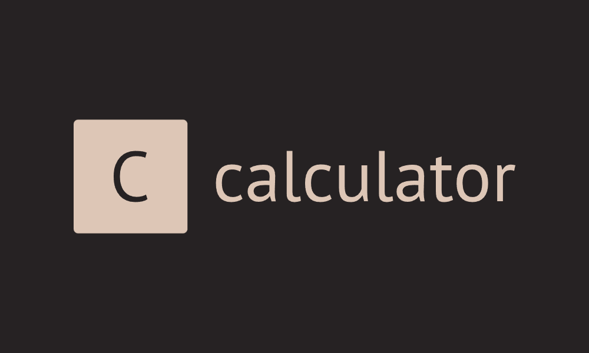

# React Calculator App

A modern, responsive calculator application built with React and Next.js, featuring a clean UI and comprehensive functionality.



## Features

- 🧮 Standard arithmetic operations
- 📝 Expression history tracking
- ⌨️ Keyboard support
- 🔢 Exponential notation for large numbers
- ↩️ Backspace functionality
- 🕒 Calculation history viewer
- 🎨 Dark mode UI

## Technologies Used

- Next.js 14
- React
- TypeScript
- Tailwind CSS
- Heroicons

## Getting Started

### Prerequisites

- Node.js 18 or later
- npm or yarn

### Installation

1. Clone the repository:

```bash
git clone https://github.com/yourusername/react-calculator.git
```

2. Navigate to the project directory:

```bash
cd react-calculator
```

3. Install dependencies:

```bash
npm install
# or
yarn install
```

4. Run the development server:

```bash
npm run dev
# or
yarn dev
```

5. Open [http://localhost:3000](http://localhost:3000) with your browser to see the calculator.

## Usage

- Click the number buttons or use your keyboard to input numbers
- Use operators (+, -, \*, /, ^) for calculations
- Press Enter or '=' to calculate
- Use Backspace to delete the last input
- Press Escape or 'C' to clear all
- Click the clock icon to view calculation history

## Keyboard Shortcuts

- `0-9`: Input numbers
- `+`, `-`, `*`, `/`, `^`: Operators
- `Enter` or `=`: Calculate
- `Backspace`: Delete last input
- `Escape`: Clear all
- `(`, `)`: Parentheses

## Contributing

Contributions are welcome! Please feel free to submit a Pull Request.

## License

This project is licensed under the MIT License - see the [LICENSE](LICENSE) file for details.

## Acknowledgments

- [Heroicons](https://heroicons.com/) for the beautiful icons
- [Tailwind CSS](https://tailwindcss.com/) for the styling
